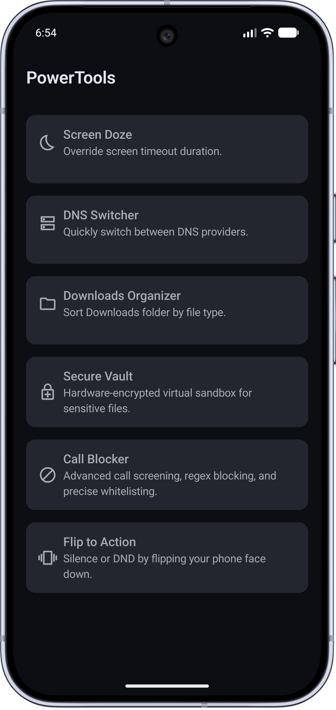
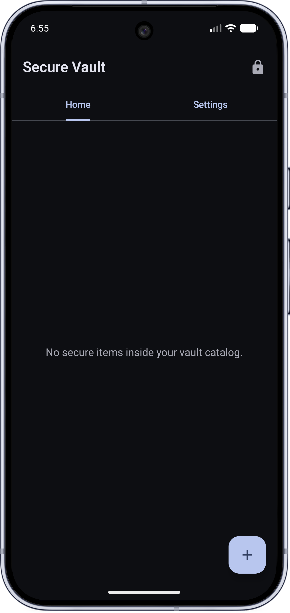
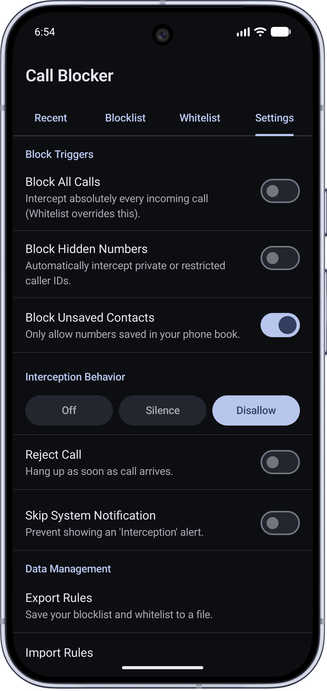

# PowerTools for Android

A lightweight, all-in-one utility app designed to give you ultimate control over your Android device.

<p align="center">
  
  &nbsp;&nbsp;&nbsp;&nbsp;
   
  &nbsp;&nbsp;&nbsp;&nbsp;
 
 &nbsp;&nbsp;&nbsp;&nbsp;

</p>

[Download](./app/release/app-release.apk)

## Features

* **Color Correction & Grayscale**
    * Adjust system display color spaces on the fly. Switch your phone to Grayscale to decrease screen fatigue and phone interaction, or easily apply native color blindness filters (Protanomaly, Deuteranomaly, Tritanomaly).
* **Advanced Call Blocker**
    * Stop spam calls instantly. Block exact numbers, use custom patterns (regex), or block all hidden/unsaved callers.
    * **Whitelist:** Ensure important contacts always get through.
    * **Custom Interception:** Choose whether to automatically hang up on blocked calls, or just silently ignore them without triggering a notification.
* **Secure Vault**
    * A completely encrypted, virtual safe for your sensitive files and photos.
    * Lock it down with a Master Password/PIN, and easily unlock it using your device's fingerprint or face scanner.
    * *Note: Files are heavily encrypted. If you lose your Master Password, your files cannot be recovered.*
* **Flip to Action**
    * In a meeting? Simply flip your phone face down on the table to instantly silence incoming calls or activate "Do Not Disturb" mode.
* **DNS Switcher**
    * Quickly switch between popular Private DNS providers (like Cloudflare, AdGuard, or Google) to block tracking, stop ads, or improve your browsing privacy.
* **Downloads Organizer**
    * Tired of a cluttered downloads folder? Tap once to automatically sort all your loose files into neat, categorized folders (Photos, Videos, PDFs, Audio, etc.).
* **Screen Doze**
    * Easily override your phone's default screen timeout settings on the fly.

## Privacy & Permissions

PowerTools is designed to work entirely on your device. **No data, call logs, or personal files are ever sent to the cloud or shared with third parties.**

To perform these system-level tasks, the app will ask for several permissions (like Contacts, Call Logs, and Storage access). 

Because **DNS Switcher** and **Color Correction** modify core Android system settings, they require a special permission (`WRITE_SECURE_SETTINGS`) that cannot be granted normally. If you wish to use these specific features, you will need to plug your phone into a computer and run a one-time ADB command provided inside the app.

```sh
adb shell pm grant com.initcn.powertools android.permission.WRITE_SECURE_SETTINGS